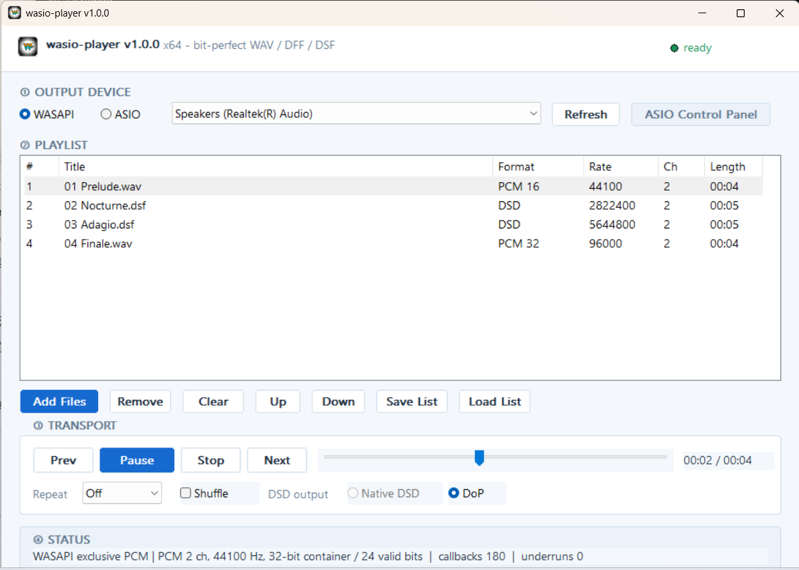

# wasio-player

A bit-perfect GUI audio player for Windows. Plays WAV, DFF and DSF through either
ASIO or WASAPI exclusive mode, with a playlist.



## What it does

**Bit-perfect, or it says so.** No sample rate conversion, no software volume,
no silent fallback. The output format follows the file: a 96 kHz track opens
the device at 96 kHz, a DSD64 file goes out as DSD64. When a device cannot take
what the file needs, playback stops with a message naming the format that was
refused rather than quietly resampling.

**DSD without a detour.** DFF and DSF play as Native DSD on ASIO, or as DoP.
DSD64 through DSD512 have been verified on hardware. Without `--dsd` the mode
follows the backend, so ASIO takes the Native DSD path and WASAPI takes DoP.
DoP512 is refused outright, because it would need a 1,411,200 Hz PCM carrier
that no current device provides, and WASAPI Native DSD is refused because its
container is indistinguishable from 32-bit PCM.

**A playlist that survives real libraries.** Drag files in, reorder them, save
and load M3U8. Paths are UTF-8 throughout, so non-ASCII file names open
correctly. An entry whose file has moved stays in the list marked unavailable
instead of vanishing.

## Build

The Steinberg ASIO SDK is not redistributable, so it is not in this repository.
Download it from Steinberg and point `ASIO_SDK_ROOT` at your copy.

```powershell
cmake -S . -B build -G Ninja -DASIO_SDK_ROOT=<path to ASIOSDK234>
cmake --build build --parallel 4
ctest --test-dir build --output-on-failure
```

`build.bat` does the same and finds `vcvars64.bat` by itself; set `VCVARS` if
it is somewhere unusual. Add `-DCMAKE_BUILD_TYPE=Release` for a release build.
Requires MSVC and C++17; builds with `/W4 /permissive-` and no warnings.

The tests need no audio hardware - they build synthetic files in memory and
drive a fake playback engine.

## The GUI Player

`WasioPlayer.exe`, optionally with files to load. Four sections, top to bottom:
the output device (WASAPI / ASIO), the playlist, the transport, and a status line
showing the format that was actually negotiated along with callback and underrun counts.

Files can be dropped onto the window. Double-clicking a row plays it. The
progress bar can be dragged to seek. Repeat is off, one or all; Shuffle covers
every track once per round.

## Playlists

M3U8, UTF-8 without a BOM, `#EXTINF:<seconds>,<title>` followed by the path.
Relative paths resolve against the playlist file's own directory. An entry that
cannot be read keeps the title and duration the playlist claimed and is shown
as unavailable, so a moved file is visible rather than silently dropped.

## Limits

- Not gapless. A track at a different sample rate needs the device reopened,
  which leaves a short gap.
- Pausing keeps the exclusive device open. That is the trade for resuming
  without a click and for an accurate position.
- WAV is integer PCM 16, 24 or 32-bit only - no float, no extensible channel
  mappings. DFF and DSF do not support DST compression or multichannel routing.
- Native DSD over WASAPI is untested; ASIO is the verified path for DSD.

## Licence

MIT - see [LICENSE](LICENSE).
